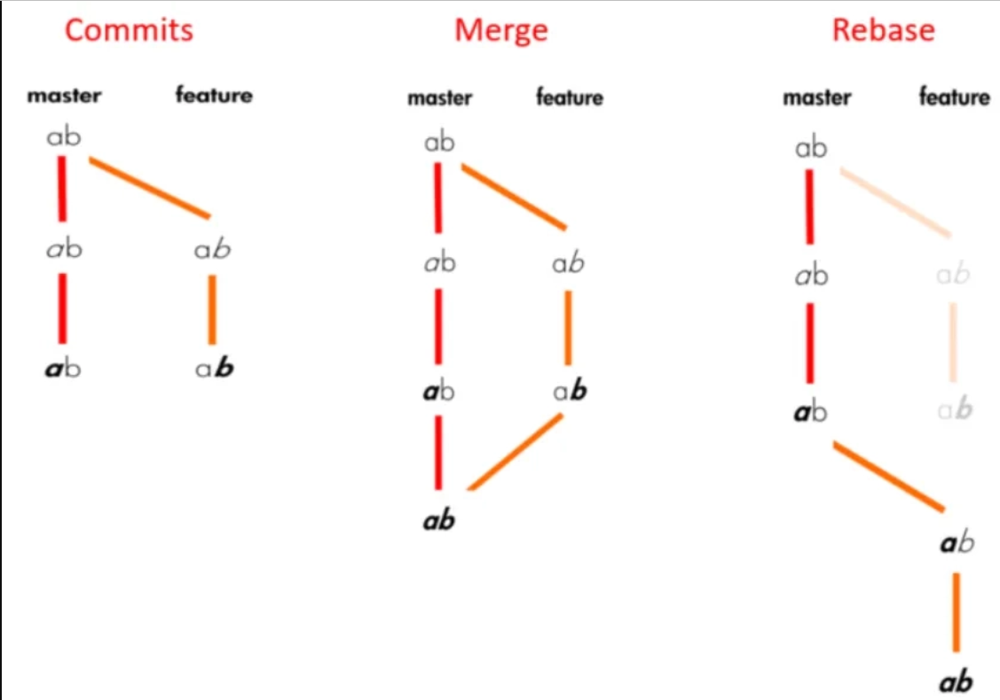
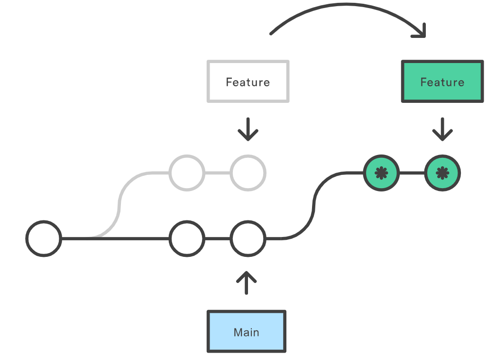

## Cheat Sheet Git et Github

This cheat sheet is about how to create a git project and how to use a simple version of git.
A list of ***Basics Commands***.

### 1) **How to start a repository**

Go to your Github account, mine is [VictorMauroy](https://github.com/VictorMauroy).
Then, go to Your Profile ==> Repositories ==> New. 
Open it, clone it. Have you set an SSH key ? Yes ? Then clone with the SSH link.

Take a terminal, go to the folder you want to import your project.
Use `git clone <you SSH project link>`.
Good, it's ready.

If you don't clone a project, you must use `git init`, to initialize the current repository as a git repository.

### 2) **Add, Save & Check**

| Command | Description |
| --- | --- |
| `git add <nom du fichier>` | Add a file as it his now to your next commit |
|`git commit`| Open a temporary text interface to enter your commit text and prepare your staging content to be send |
|`git commit -m "Description/reasons"`| One line commit without opening a text interface|
|`git commit --amend`|Allow to update the last commit message or add the current staging data|
|`git log`|Show the last commits with their descriptions|
|`git diff`|Show the modifications between your currents files and the last commit|
|`git status`|Show staging modifications and modified files|

### 3) **Send, Receive, Remote & Upstream**

| Command | Description |
| --- | --- |
| `git push` | Send local commits to remote repository|
| `git pull` | Receive remote changes and merge them to our local repository |
| `git fetch` | Receive remote changes without merging|

#### **Remote and upstream**
The main remote link is the origin of our own remote repository. 
 It is also possible to add the link of an *upstream repository*, which is the repo of another user. Mainly used when we work with someone else.

| Command | Description |
| --- | --- |
|`git remote -v`|List all remote connections with their URL|
|`git remote add <new name/alias> <url>`|Add a new remote connection and create a name/alias to quickly access it|
|`git remote rm <name/alias>`|Delete a remote connection|
|`git remote set-url <name/alias> <new url>`|Change URl of a specified remote|
|`git remote rename <old name> <new name>`|Change remote name/alias|
|`git remote prune <branch name>`|Remove a branch which do not exist in the remote repo|

### 4) **Manage branchs**

| Command | Description |
| --- | --- |
|`git branch <branch name>`|Create a branch|
|`git switch <branch name>`|Move to another branch|
|`git branch`|List all existing branchs. Special char '*' for current branch|
|`git branch -d <branch name>`|Remove a branch|
|`git branch -m <new branch name>`|Move the current branch and change its name / rename a branch|

### 5) **Remove, Restore & Revert**

| Remove commands | Description |
| --- | --- |
|`git rm <file or folder>`|Delete a file/folder in your local workspace and local git repository|
|`git rm -rf <directory>`|Delete a folder and every files contained in it|
|`git rm --cached <file/folder>`|Delete a file/folder on your local git repo but not from your workspace|
|**Reset commands**|**Description**|
|`git reset <file/folder>`|Undo git add but not local modifications / unstage files|
|`git reset --hard`|Undo every modifications and unstage every files since last commit|
|`git reset <commit id>`|Do not modify workspace but go to the specified commit and delete every commit done afterward|
|**Revert commands**|**Description**|
|`git revert <commit id>`|Create a new commit which is the opposite of the specified one|

### 6) **Merge & Rebase**

| Command | Description |
| --- | --- | 
|`git merge <branch to integrate>`|Merge the specified branch history into the current one|
|`git rebase <commit id>`   `git rebase <from branch>`|Apply every commit of current branch ahead of a specified one|
|`git rebase -i <commit id or branch>` |Do the same as rebase but open a special interface to squash, edit, rename or delete commits|

Rebase & Merge understanding

</img>  

Both are used to integrate changes from one branch to another.

**Rebase :** The main purpose of `git rebase` is that it will allow to obtain a much more simplified history. It changes the "base" of your branch by adding the commits of another one to its origin.
    

    
Detailed scheme

    </img>
    

*Warning : do your best to avoid making git rebase if you already pushed to a public repo the commits of the branch you are gonna rebase. If you already did, you'll have to use `git push --force`.*

### 7) **Others : must know**

